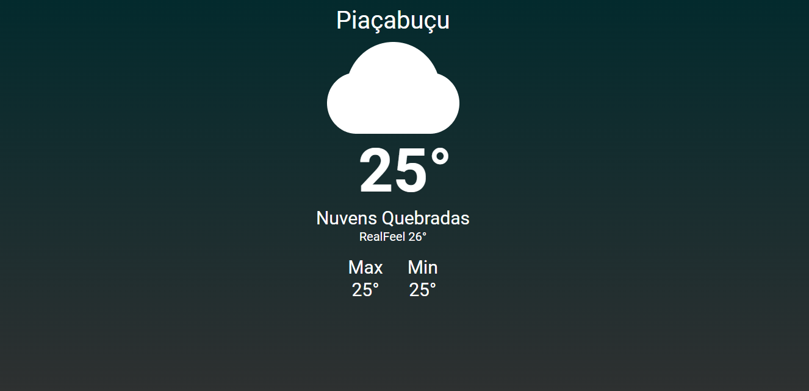

# Projeto Weather

## Descrição

O projeto consiste em um site que mostra a temperatura atual, além da máxima e mínima da região em que o usuário está. O site utiliza da geolocalização do navegador para pegar as coordenadas do usuário (latitude e longitude) e consultar a API Openweathermap para pegar as informações do clima na região e exibi-las.

## Tecnologias utilizadas

 
 

- React JS;
- Typescript;
- HTML5;
- CSS;
- API (versão gratuita) do Openweathermap.

## Screenshot

